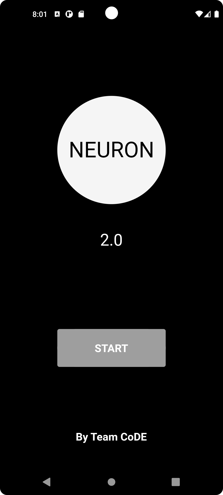
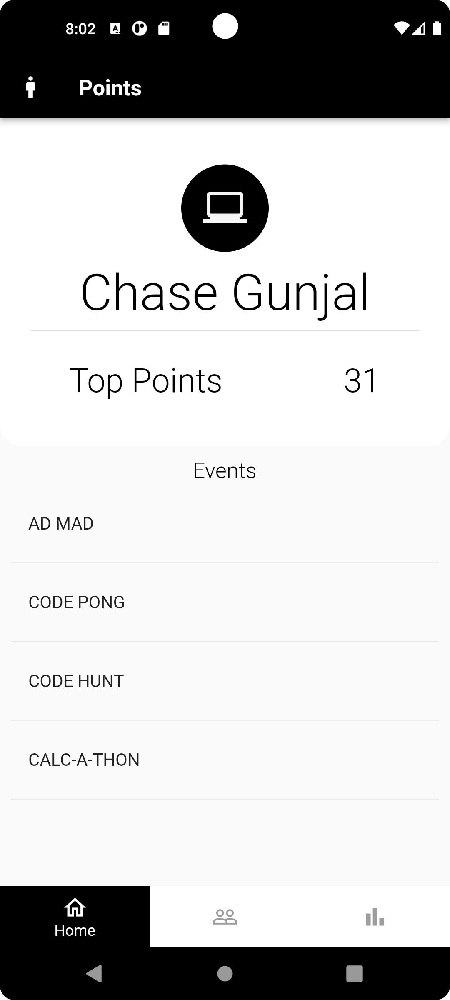
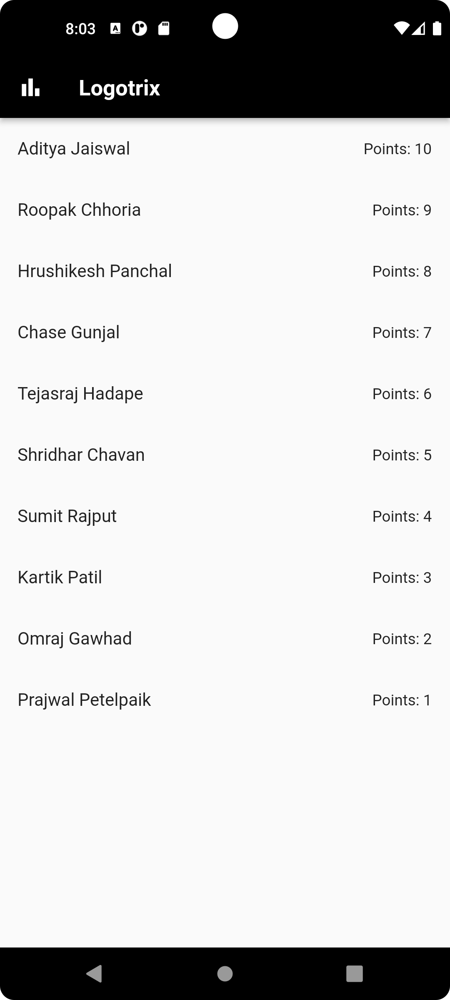
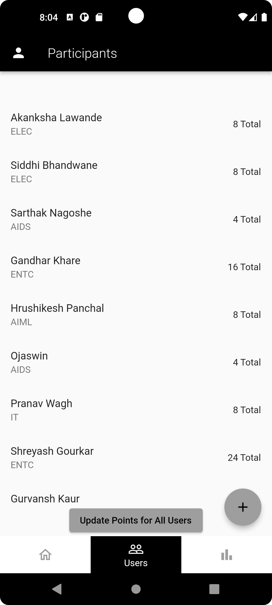
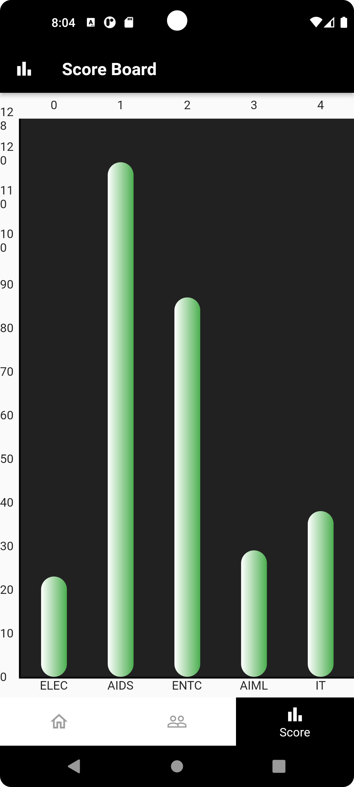

# Club of Data Engineers App

This is an Events Points app, developed for the event Neuron 2.0, conducted by the Club of Data Engineers.

**Note1: The backend for this app is connected to my Firebase**
**Note2: This is a very premature app, the UI, isn't well done yet.**

## Getting Started

1. Ensure you have Flutter and Android Studio IDE installed on your device.
2. Download a local emulator on your IDE.
3. Go to .github/CONTRIBUTING.md to check, how you can contribute.
4. Once you fork or clone the repo to your, local, run the generate_google_services.sh bash file. `bash generate_google_services.sh`.
5. Check if google-services.json has been created in android\app. Ensure if quotations and format is correct of that file.
6. Run `flutter pub get` in terminal of root directory of project, to get all dependencies.

## Some Screenshots

### * Start Page

### * Top Events Points Scorer

### Event-wise Leaderboard

### Participants Record

### Departemnt Leaderboard

